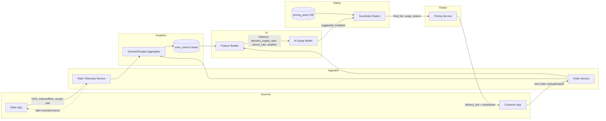

# Question 7: Dynamic Pricing Engine — Surge Pricing

**Goal:** ปรับค่าส่งตาม Demand/Supply แบบ real-time โดย AI แนะนำ + Guardrails กันราคาเกินกฎหมาย

---

## 1. Architecture — Data Flow Diagram



### Text Flow (สรุป)

```
1. Rider App  → ส่ง GPS, สถานะ online, accept/reject rate
2. Customer App → สร้าง order (pickup, dropoff, zone)
3. Aggregator → คำนวณ demand/supply ratio ต่อ zone ทุก 1 นาที
4. Feature Builder → รวม features ส่ง AI Model
5. AI Model → แนะนำ surge_multiplier (เช่น 1.4x)
6. Guardrails Engine → clamp ตามกฎ hard-coded + นโยบาย
7. Pricing Service → คืน final_fee + เหตุผล surge ไป Customer App
8. Customer App → แสดงราคาก่อนยืนยันสั่งซื้อ (Price Transparency)
```

### Key Components

| Component | หน้าที่ |
|-----------|---------|
| **Rider Telemetry** | นับ rider ว่าง/ไม่ว่าง ต่อ zone |
| **Demand/Supply Aggregator** | `pending_orders / available_riders` |
| **AI Surge Model** | แนะนำ multiplier จาก historical + real-time |
| **Guardrails Engine** | Hard cap — AI แนะนำเท่าไหร่ก็ตาม ต้องผ่านกฎนี้ |
| **Pricing Service** | `final_fee = base_fee × clamped_multiplier` |

### AI Model Input Features

```json
{
  "zone_id": "silom",
  "demand_supply_ratio": 3.2,
  "pending_orders": 45,
  "available_riders": 14,
  "rider_cancel_rate_1h": 0.18,
  "weather": "heavy_rain",
  "rush_hour": true,
  "base_delivery_fee": 35
}
```

### AI Model Output

```json
{
  "suggested_multiplier": 2.8,
  "confidence": 0.82,
  "reasoning": "high demand, low supply, heavy rain"
}
```

---

## 2. Safety & Ethics — Hard-coded Guardrails

> AI อาจแนะนำ 2.8x แต่ Guardrails บังคับไม่เกินกฎที่กำหนด — **AI แนะนำได้ แต่ไม่มีสิทธิ์ตั้งราคาสุดท้าย**

### Guardrail Rules (Hard-coded)

| # | Rule | ค่า | เหตุผล |
|---|------|-----|--------|
| G1 | **Max surge multiplier** | ≤ 2.0x | ไม่เกิน 100% ของค่าส่งปกติ |
| G2 | **Max absolute fee** | ≤ 150 บาท | เพดานราคาสูงสุดต่อออเดอร์ |
| G3 | **Max increase per step** | ≤ +0.3x / 5 นาที | ป้องกันราคากระโดดทันที |
| G4 | **Min riders check** | supply < 3 → ไม่ surge | ไม่เอาเปรียบเมื่อข้อมูลไม่พอ |
| G5 | **Emergency freeze** | surge = 1.0x | ภัยพิบัติ/เคอร์ฟิว — ห้าม surge |
| G6 | **Transparency required** | แสดงเหตุผล + ราคาเดิม | กฎหมายคุ้มครองผู้บริโภค — ต้องรู้ก่อนจ่าย |
| G7 | **Consent threshold** | > 1.5x → ยืนยันใหม่ | ลูกค้าต้องกดยอมรับราคาสูง |
| G8 | **Audit log** | บันทึก AI vs final ทุกครั้ง | ตรวจสอบย้อนหลังได้ |

### Consumer Protection Alignment (Thailand)

| หลักการ | การ implement |
|---------|---------------|
| **ความโปร่งใส** | แสดง base_fee, surge_amount, เหตุผล (ฝนตก/คนขับน้อย) |
| **ไม่ฉ้อโกง** | Hard cap ป้องกันราคาเกินสมเหตุสมผล |
| **เลือกได้** | ลูกค้าเห็นราคาก่อน confirm — ไม่เปลี่ยนหลังสั่ง |
| **ตรวจสอบได้** | Audit trail: `ai_suggested` vs `final_applied` |

---

## 3. Guardrails Code

ดูไฟล์ `question-07-surge-guardrails.js`

### ตัวอย่าง Scenario

```
base_fee = 35 บาท
AI แนะนำ = 2.8x → 98 บาท

Guardrails:
  G1: min(2.8, 2.0) = 2.0x → 70 บาท
  G2: min(70, 150) = 70 บาท
  G7: 2.0 > 1.5 → ต้องให้ลูกค้ายืนยัน surge

Customer App แสดง:
  "ค่าส่งปกติ 35 บาท → ค่าส่งช่วงเร่งด่วน 70 บาท (x2.0)
   เหตุผล: มีออเดอร์มาก ไรเดอร์น้อย ฝนตกหนัก"
  [ยืนยันสั่งซื้อ] [ยกเลิก]
```

### Scenario ผิดกฎหมาย (ถ้าไม่มี Guardrails)

```
AI แนะนำ 5.0x → 175 บาท
  → แพงเกินสมเหตุสมผล
  → ลูกค้าไม่มีทางเลือก
  → เสี่ยงผิด พ.ร.บ. คุ้มครองผู้บริโภค (ราคาไม่เป็นธรรม)
```

---

## 4. Architecture Principle

```
┌─────────────────────────────────────────────┐
│  AI = Advisor (แนะนำ)                        │
│  Guardrails = Authority (ตัดสินราคาสุดท้าย)  │
│  Human Policy = Law (กฎที่แก้ไม่ได้ด้วย AI)  │
└─────────────────────────────────────────────┘
```

- AI ไม่มีสิทธิ์ตั้งราคาโดยตรง
- ทุก response ผ่าน Guardrails ก่อนถึงลูกค้า
- Kill switch: ปิด AI surge → ใช้ fixed multiplier table

---

## 5. Monitoring

| Alert | Action |
|-------|--------|
| Guardrail clamp > 30%/ชม. | Review AI model |
| Customer surge reject > 40% | ลด max multiplier |
| Fee complaint spike | Freeze surge ใน zone นั้น |
| AI confidence < 0.5 | ใช้ rule-based table แทน |
